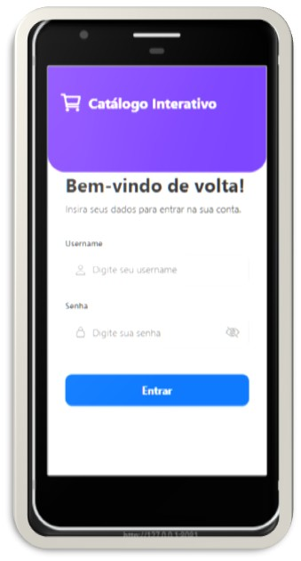
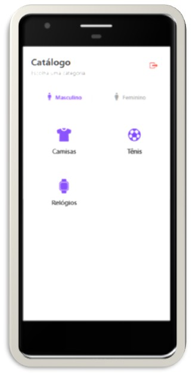
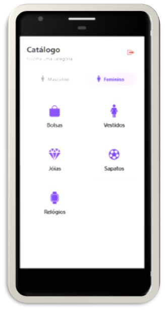
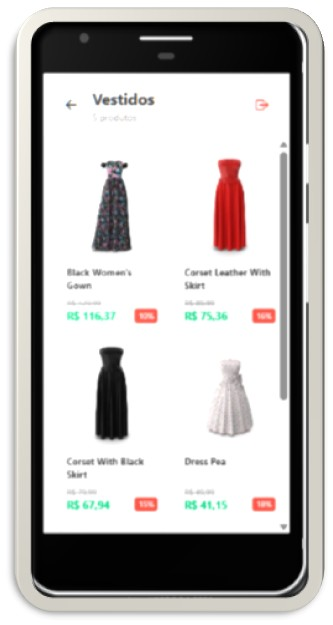
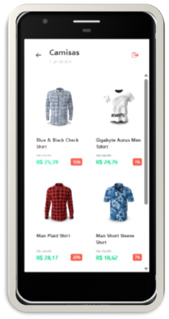

Ì≥± Cat√°logo InterativoAplicativo mobile desenvolvido em React Native com Expo para cat√°logo de produtos, consumindo a API p√∫blica DummyJSON. O app apresenta produtos organizados por categorias com navega√ß√£o por abas, tela de detalhes e sistema de login simulado.Ì≥å √çndiceSobre o ProjetoFuncionalidadesTecnologias UtilizadasDemonstra√ß√£o das TelasEstrutura do ProjetoInstala√ß√£o e Execu√ß√£oDesafios e Solu√ß√µesAutorSobre o ProjetoO Cat√°logo Interativo √© um projeto acad√©mico desenvolvido para demonstrar conceitos fundamentais do desenvolvimento mobile. O objetivo principal √© criar uma experi√™ncia flu√≠da de navega√ß√£o por categorias de produtos (Masculino/Feminino), consumindo dados reais e proporcionando uma interface amig√°vel.‚ú® FuncionalidadesTela de Login: Valida√ß√£o de campos, controlo de visibilidade de senha e feedback visual.Navega√ß√£o por Abas: Separa√ß√£o intuitiva entre departamentos Masculino e Feminino.Consumo de API: Listagem din√¢mica de produtos usando Axios e a API DummyJSON.Detalhes do Produto: Galeria de imagens, informa√ß√µes t√©cnicas, pre√ßos com desconto e avalia√ß√µes.Feedback ao Utilizador: Estados de carregamento (Loading), Pull-to-refresh e tratamento de erros com alertas.̪† Tecnologias UtilizadasTecnologiaFinalidadeReact Native / ExpoFramework e plataforma principalAxiosCliente HTTP para requisi√ß√µes √† APILucide React / Expo Icons√çcones da interfaceEAS BuildFerramenta para gera√ß√£o de APK nativoÌ≥± Demonstra√ß√£o das TelasAbaixo, pode conferir a interface do aplicativo. (Nota: Certifique-se de que os ficheiros existem na pasta assets/screenshots/ no seu reposit√≥rio)LoginHome MasculinoHome FemininoDetalhes (Vestidos)Lista (Camisas)Ì≥Ç Estrutura do Projetocatalogo-interativo/
├── assets/
│   └── screenshots/         # Prints das telas (Imagens do README)
├── App.js                  # Componente principal e lógica de navegação
├── app.json                # Configurações do Expo
├── package.json            # Dependências e scripts
└── README.md               # Documentação
Ì∫Ä Instala√ß√£o e Execu√ß√£oClone o reposit√≥rio:git clone [https://github.com/EvanildoLeal/catalogo-interativo.git](https://github.com/EvanildoLeal/catalogo-interativo.git)
cd catalogo-interativo
Instale as dependências:npm install
Inicie o projeto:npx expo start
Escaneie o QR Code com a app Expo Go no seu telem√≥vel.‚ö° Desafios e Solu√ß√µesIncompatibilidade SDK: Resolvido utilizando o EAS Build para gerar um APK de preview, contornando limita√ß√µes de vers√£o do Expo Go.Navega√ß√£o Customizada: Implementa√ß√£o de um sistema de navega√ß√£o baseado em estados (useState) para evitar depend√™ncias pesadas em um projeto acad√©mico leve.̱§ AutorEvanildo LealDesenvolvido para a disciplina de Mobile Development - Faculdade FECAF (2026)
